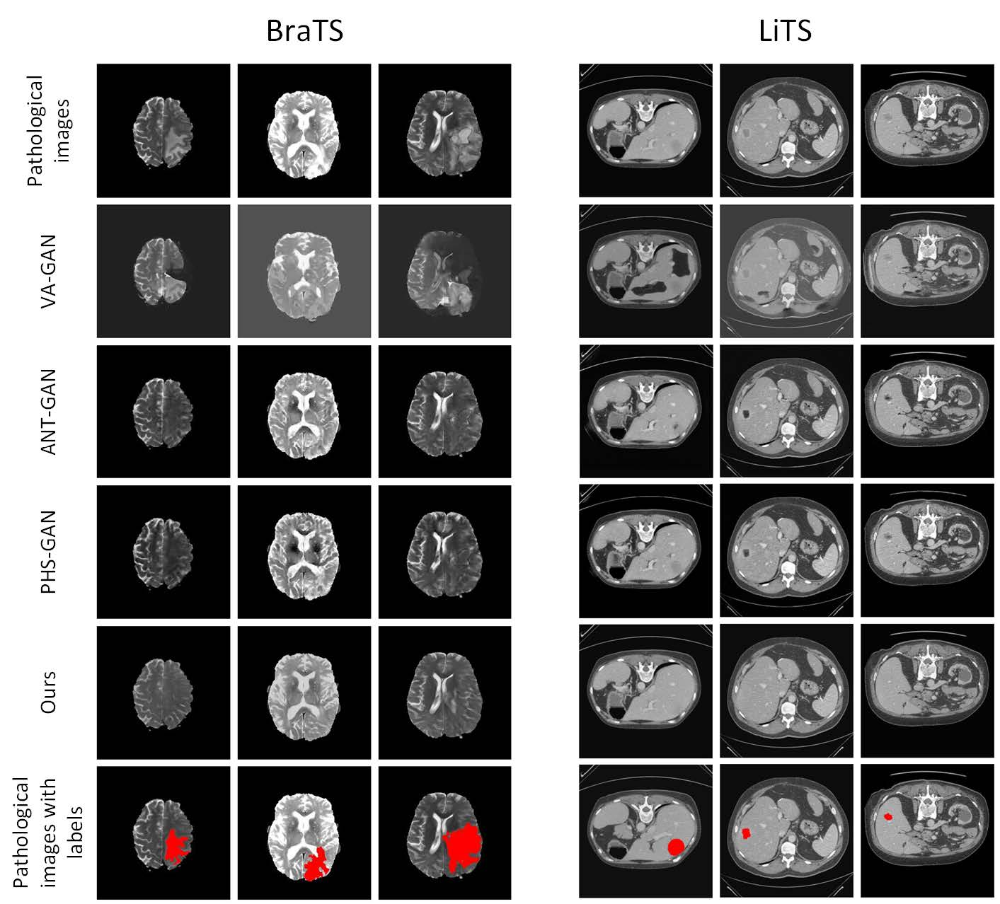
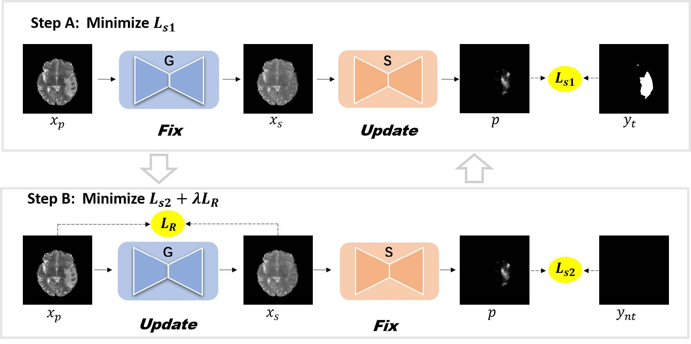
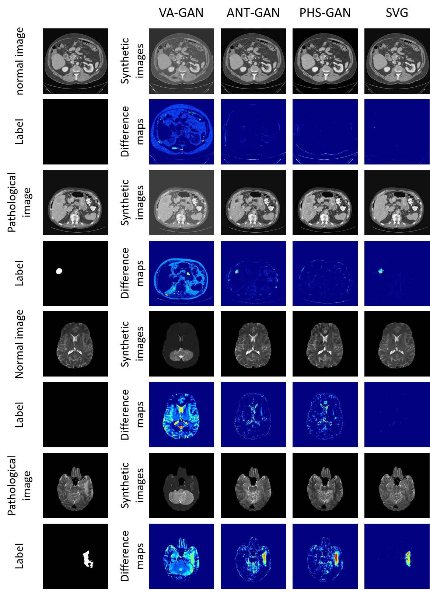

<p align="center">
  <a href="" rel="noopener">
 </a>
</p>

<h1 align="center">Generator Versus Segmentor</h1>

<!-- <div align="center">

[]()
[](https://github.com/kylelobo/The-Documentation-Compendium/issues)
[](https://github.com/kylelobo/The-Documentation-Compendium/pulls)
[](/LICENSE)

</div> -->


<p align="center"> An implementation for 'Generator Versus Segmentor: Pseudo-healthy Synthesis'.
</p>

## 📝 Table of Contents

- [About](#about)
- [Getting Started](#getting_started)
- [Deployment](#deployment)
- [Usage](#usage)
- [Authors](#authors)
- [Acknowledgments](#acknowledgement)

## 🧐 About <a name = "about"></a>

This is an implementation for 'Generator Versus Segmentor: Pseudo-healthy Synthesis'.[[arXiv]](https://arxiv.org/abs/2005.08104)

<p align="center"> Abstract</p>

<p align="justify">In this paper, we discuss the problems of these approaches, which are the style transfer and artifacts respectively. To address these problems, we consider the local differences between the lesions and normal tissue. To achieve this, we propose an adversarial process that alternatively trains a generator and a segmentor. The segmentor is trained to distinguish the synthetic lesions (i.e. the region in synthetic images corresponding to the lesions in the pathological ones) from the normal tissue, while the generator is trained to deceive the segmentor and preserve the normal tissue at the same time. Qualitative and quantitative experimental results on public datasets of BraTS and LiTS demonstrate that the proposed method outperforms state-oftheart methods by preserving the style and removing the artifacts.</p>


<div align="center"></div>
<div align="center"></div>
<!--  -->

## 🏁 Getting Started <a name = "getting_started"></a>

These instructions will get you a copy of the project up and running on your local machine for development and testing purposes. See [deployment](#deployment) for notes on how to deploy the project on a live system.

### Prerequisites

First check your enviroment.

```
pytorch >= 1.3.1
python >= 3.6
opencv-python >= 4.3
```

### File Tree

```
│  predict_lits.py           # evaluate a model by some index, and extract images
│  README.md
│  train_brats.py            # our main code, tarin our model on BraTS
│
├─unet
│  │  unet_model.py          # store basic model
│  │  unet_parts.py          # basic part of model
│  
└─utils
    │  dataset.py            # dataloader
    │  dice_loss.py 
    │  init_logging.py       # initial a logger to write a log
    │  ms_ssim.py
    │  nii2npy_brats.py    # split .nii in to .npy to train 
    │  split_cases_brats.py  # split cases into train/val/test set

```

## 🎈 Usage <a name="usage"></a>

Add notes about how to use this code.

* Prepare your LiTS/BraTS Dataset by following step:
  
  * Download LiTS/BraTS Dataset to your hardrive
  * Run ```./utils/nii2npy.py```to split into slices
  * Run ```./utils/split_cases_brats.py``` to split slices into train/val/test set, and it will generrate a text like ```./data/train_brats.txt```
* Then you can train you model by running ```train_brats.py```
* You can evaluate your model by running ```predict_brats.py```


## ✍️ Authors <a name = "authors"></a>

- [@dazhangyu123](https://github.com/dazhangyu123)
- [@Au3C2](https://github.com/Au3C2)
- [utdawn](https://github.com/utdawn)

## 🎉 Acknowledgements <a name = "acknowledgement"></a>

- Hat tip to anyone whose code was used
- Inspiration
- References

## Citation
We hope that you find this work useful. If you would like to acknowledge us, please, use the following citation:
```
@inproceedings{Araslanov:2020:WSEG,
  title     = {Single-Stage Semantic Segmentation from Image Labels},
  author    = {Araslanov, Nikita and and Roth, Stefan},
  booktitle = {Proceedings of the IEEE Conference on Computer Vision and Pattern Recognition (CVPR)},
  year = {2020}
}
```